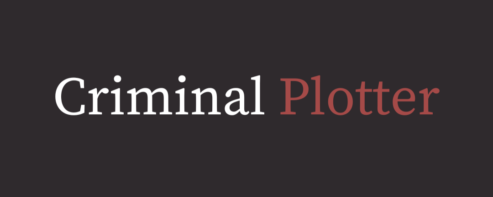

# CriminalPlotter

**Data**: Outubro de 2024  

## Abstract

Em 2023, o Brasil registrou 47.722 assassinatos e 2.226 roubos e furtos para cada 100 mil habitantes. A situação fica ainda mais preocupante quando se considera que a taxa de solução de crimes é 65%, sendo em torno de 35% quando se trata de homicídios.

Um dos fatores responsáveis pela baixa resolução de casos é a escassez de recursos e profissionais: o Brasil tem uma média de 1 perito criminal para cada 41.500 habitantes, enquanto a recomendação da ONU seria, no mínimo, 1 em cada 5.000. No estado de São Paulo, por exemplo, em um único dia, os especialistas chegam a percorrer 300 km em até 17 locais de crime diferentes, o que significa que muitas ocorrências são deixadas de lado e, nas que não são, não há tempo suficiente para uma análise crítica.

Para reduzir esses números dramáticos, os autores propõem a criação de uma impressora que esboça retratos criminais de potenciais suspeitos com base em um catálogo físico de traços faceais pré-definidos, evitando a necessidade de ter um artista forense no local.

## Introdução

Em 2023, o Brasil registrou 47.722 assassinatos em um ano, 10,4% do total mundial. Em homicídios per capita, está na 11ª posição, com 22,38 mortes a cada 100 mil habitantes, quase 1000% da média da OCDE, 400% da média global e 150% da média na América Latina. Em termos de roubos e furtos, o Brasil tem 2.226 para cada 100 mil habitantes. A situação fica ainda mais preocupante quando se considera que a taxa de solução de crimes é 65%, sendo em torno de 35% quando se trata de homicídios.

Um dos fatores responsáveis pela baixa resolução de casos é a escassez de recursos e profissionais: o Brasil tem uma média de 1 perito criminal para cada 41.500 habitantes, sendo que o recomendado pela ONU seria, no mínimo, 1 em cada 5.000. No estado de São Paulo, por exemplo, em um único dia, os especialistas chegam a percorrer 300 km em até 17 locais de crime diferentes, o que significa que muitas ocorrências são deixadas de lado e, nas que não são, não há tempo suficiente para uma análise crítica.

Os autores propõem, portanto, a criação de uma impressora de esboço forense de rosto com fácil operação e baixo custo, visando dar maior autonomia às vítimas e reduzir a excedente demanda por peritos criminais. Esta impressora é baseada em métodos já existentes para retrato criminal forense e reconhecimento facial.

## Revisão de literatura

### O procedimento forense

Esboços forenses são geralmente utilizados quando não há nenhuma foto ou vídeo do criminoso, sendo particularmente valiosos quando a única fonte de informação são as vítimas e testemunhas. Eles podem ser feitos por dois modos: desenhados à mão por um artista ou criados graficamente pela composição de componentes faciais (olhos, boca, cabelo, etc) retirados de uma base de dados, sendo a segunda opção algo relativamente recente.

Após essa etapa, pode-se divulgar a imagem em veículos midiáticos, ou, nos casos de haver mais recurso à disposição, fazer uma busca do rosto esboçado em uma base de dados. Essa pesquisa pode levar em consideração todo o rosto ou apenas alguns de seus componentes. Neste trabalho, no entanto, nos limitaremos apenas à parte de esboço.

### O método do esboço

Geralmente preferível a biometria, DNA e outros métodos de identificação pela conveniência e custo relativamente menor, o esboço criminal feito por um artista forense ainda apresenta a inconveniência de necessitar um perito com anos de prática nessa arte disponível, realidade distante do contexto brasileiro. Uma alternativa buscada, portanto, tem sido o esboço composto via software, que está sendo amplamente utilizado desde os anos 2000. No Brasil, no entanto, onde apenas recentemente foi inaugurado um sistema de reconhecimento facial, esse tipo de tecnologia ainda está longe de ser aplicada em larga escala, fazendo-se necessária uma adaptação da técnica para o contexto nacional.

### Identificação facial

A teoria de identificação facial tem sua gênese na década de 1960, com os estudos de Bledsoe que utilizavam computadores e 20 medidas de componentes faciais inseridas pelo usuário. Na década de 1970, com os estudos de Harmon e Goldstein, foi proposto um algoritmo de busca binária para encontrar um rosto baseado em 21 características relacionadas aos componentes faciais, como cabelo "comprido", "encaracolado" e "grosso". Baseado em uma descrição prévia de um rosto, os participantes eram dados 255 retratos e separavam em uma pilha os que continham a característica informada dos que não a tinham. Os resultados "surpreendentemente bons", nas palavras de Harmon, foram 53% de acerto com uma média de 7.3 características usadas, sendo que, em 75% dos casos, o retrato correto estava entre os últimos 13.

Na década de 1980, esse campo de estudo ficou relativamente dormente, retornando na seguinte com muita intensidade, devido a diversos avanços tecnológicos, como a inteligência artificial, que eliminou a necessidade de ter características subjetivas, como as anteriores. Nesse sentido, Pertland e Tik, dois pesquisadores do MIT, inventaram o primeiro sistema de reconhecimento facial, "Eigenfaces". Em 1998, a agência governamental estadunidense DARPA criou a primeira base de imagens robusta, com 2.400 fotos de 850 pessoas.

Por fim, com o desenvolvimento do "Deep Learning" e redes neurais na década de 2010, outra revolução ocorreu. Em 2014, por exemplo, a empresa "Facebook" afirmou que conseguia reconhecer faces com 97% da precisão humana com o algoritmo "Deepface".

Os sistemas mais modernos variam entre uma abordagem de reconhecimento de componente versus reconhecimento da imagem como um todo. Em particular, na década de 2020, os modelos de "Deep Learning" evoluíram a ponto de estarem próximos da performance de um especialista em reconhecimento facial, por mais que a precisão máxima seja alcançada quando ambos trabalham em conjunto.

## Catálogo de características faciais

Da revisão de literatura, entende-se que a abordagem mais adequada ao contexto brasileiro seria a criação de um catálogo que mimetiza o conceito de esboço composto sem a necessidade de um software. No entanto, se não há uma base de dados, surge o problema de como saber quantas características seriam necessárias para determinar o rosto aproximado do criminoso. Baseados nos modelos de Harmon, sabe-se que, dados as 21 características, é possível encontrar um rosto entre 2 milhões de retratos através da busca binária. Assim, baste que haja uma imagem para cada variação de característica para ter, no mínimo, 2 milhões de retratos possíveis, e, no máximo, a permutação de todas as possibilidades de características, equivalente a 10 milhões, aproximadamente.

## Criminal Plotter

Em consonância com o catálogo, os autores propõem uma impressora que recebe um número de 3 dígitos, os primeiros 2 responsáveis pela característica (01 a 21) e o último pela variação dela (1 a 3), e, através da técnica de pontilhação, imprime o desenho selecionado. Como a relevância das características faciais tende a reduzir do cabelo até o queixo, insere-se os números em ordem decrescente de altura.

## Desenvolvimento Técnico

O funcionamento do projeto baseia-se na movimentação em eixos, utilizando três motores de passo (28BYJ-48 - 5V), três drivers ULN2003, um Arduino BlackBoard R3, uma placa ProtoShield e um NumPad de 3 colunas e 4 linhas, com alimentação mínima de 5V.

A parte física do plotter foi modelada no Tinkercad e impressa com filamento PLA branco (500g). Para a construção do banco de características, será utilizado um código em Python para converter uma imagem em preto e branco em uma matriz, onde os elementos podem ser representados por 1 byte para cada pixel (0 para preto e 1/255 para branco). Após a conversão, as características da imagem serão utilizadas para a construção de cada perfil.

Inicialmente, o sistema aguardará a entrada de dois dígitos: o primeiro para selecionar a característica desejada (nariz, rosto) e o segundo para escolher o formato do modelo. Em seguida, o plotter realizará uma busca linha por linha na matriz, identificando os valores do desenho (0 ou 1/255) para marcar a margem, previamente definida pela resolução da imagem, e se moverá até a posição correta para iniciar o desenho, rotacionando e abaixando a caneta até encostar no papel com a pressão adequada.

As movimentações são controladas por funções dedicadas. Após a combinação de características selecionadas, a matriz correspondente será salva para futuras exportações.

Para exportar a imagem, o código em Python receberá a matriz e fará a conversão para uma imagem no formato desejado.
